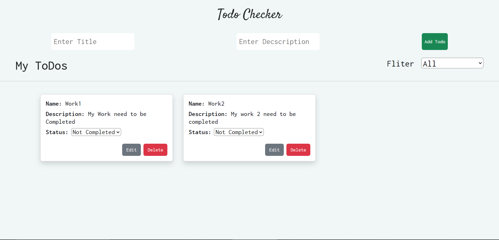

### React ShoppingCart Task ###   
Create a Todo App which have All CRUD Functionalities   

1. Create Todo Task with task name , Description & status     
2. By default status needs to added as not completed for created todo   
3. There should be two buttons in the name of edit and Delete which used to perform update and delete created todos   
4. By onclick on status it should show a dropdown for completed and not completed by that we can change the status of todo   
5. All todos should be displayed in Card   
6. There should be filter to display status completed, not completed and both statuses   

### How to use the Todo APP  ###   
1. First of all , Ypu need to enter your activities tile and description of your activity.   
2. Then enter the Add Todo Button to Add your activity to the list.   
3. If you want to edit your activities title and description there will a edit buttton , where you can edit your activity.   
4. If your want remove your todo , press the delete butoon.   
5. After the task completed , change the status of the todo activity to completed.   
6. If you want to check which todos are completed and which aren't, ther will be a filter option , so that tou can filter the todos which are completed and which aren't.   

### For more knowledge View Below image ###   
